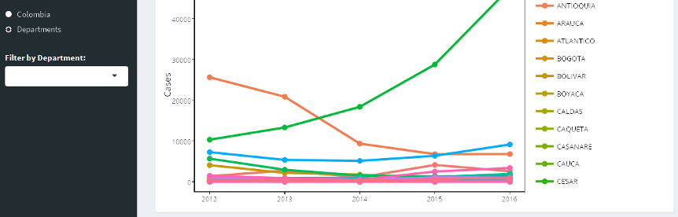

## Malaria Cases in Colombia (2007-2016)

This app shows a graph with the number of malaria cases in Colombia from 2007 to 2016. You can select the range of the years you want to see from the slidebar. 

 

## 
If you change the option from "Colombia" to "Departments" the graph shows the values for all departments through the years

## 
You can filter the data shown by department by choosing one in the box "Filter by Department"

## Table and Map
Additionally the app shows a table with the data so you can order the data by year, department or cases. Finally, we have a map that shows the cases for the last year in the range. If you want the map to show other year you have to select that year as your ending year in the range for the first panel.

